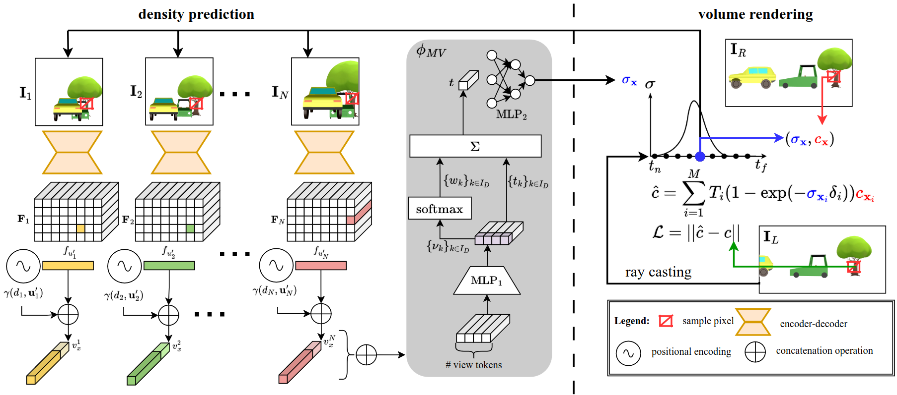
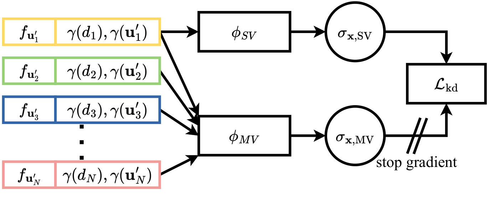
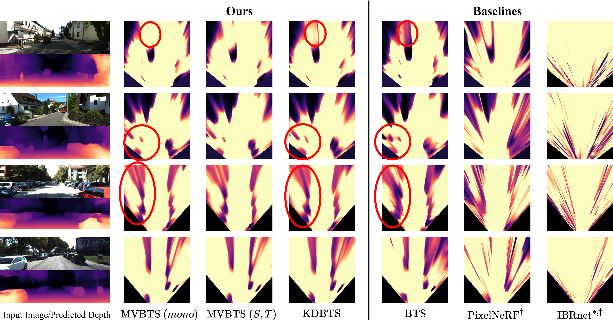

***Fig. 1. Knowledge Distillation from Multi-View to Single-View.** We propose to boost single-view scene completion by exploiting additional information from multiple images. a) we first train a novel multi-view scene reconstruction algorithm that is able to fuse density fields from multiple images in a fully self-supervised manner. b) we then employ knowledge distillation to directly supervise a state-of-the-art single-view reconstruction model in 3D to boost its performance*

<!-- 
<video width="100%" autoplay muted loop>
  <source src="./assets/header_video.mp4" type="video/mp4">
Your browser does not support the video tag.
</video>

***Video 1. SSC Predictions on KITTI-360.** Input image (top), color-coded voxel grids (bottom). The voxels indicate if a certain region is occupied or not, the color indicates the class. A color to class map can be found in Figure 2. We compare the predictions of our S4C against the ground truth and other fully supervised state-of-the-art methods. The current method is displayed in the bottom left corner.*
 -->

# Abstract

Inferring scene geometry from images via Structure from Motion is a long-standing and fundamental problem in computer vision. While classical approaches and, more recently, depth map predictions only focus on the visible parts of a scene, the task of scene completion aims to reason about geometry even in occluded regions. With the popularity of <cite>[neural radiance fields (NeRFs)][1]</cite>, implicit representations also became popular for scene completion by predicting so-called density fields. Unlike explicit approaches e.g. voxel-based methods, density fields also allow for accurate depth prediction and novel-view synthesis via image based rendering. In this work, we propose to fuse the scene reconstruction from multiple images and distill this knowledge into a more accurate single-view scene reconstruction. To this end, we propose Multi-View Behind the Scenes(MVBTS) to fuse density fields from multiple posed images, trained fully self-supervised only from image data. Using knowledge distillation, we use MVBTS to train a single view scene completion network via direct supervision called KDBTS. It achieves state-of-the-art performance on occupancy prediction, especially in occluded regions.

# Aggregating Visilibity and Distillating its Knowledge 

The proposed architecture focuses on leveraging multi-view posed images to enhance single-view reconstruction through a knowledge distillation scheme. This innovative approach incorporates a shared encoder and decoder backbone network from the "Behind The Scenes" model to handle multi-view input images efficiently. Built upon this framework, a compact multi-layer perceptron (MLP) denoted as $\phi_{SV}$ decodes density from feature vectors with positional encoding, facilitating a more comprehensive understanding of visibility aspects within the model. The integration of multi-view-aware density prediction contributes to a deeper grasp of scene visibility nuances. Utilizing geometry prediction and image-based rendering techniques within a differentiable volumetric rendering pipeline enables the reconstruction of images, thus enabling the utilization of photometric reconstruction loss for network training.

The main contributions of this work can be summarized as follows:

## MVBTS

This component extends single-view density prediction by introducing a confidence-based multi-view architecture. It leverages multiple input images to aggregate information effectively.

$ \sigma_{\textbf{x}} = \phi_{MV}(t_0, \{f_{\textbf{u}^\prime_k}, \gamma(d_k, \textbf{u}^\prime_k)\}_{k\in I_D}) $

$ \sigma_{\textbf{x}} = \phi_{MV}(\{f_{\textbf{u}^\prime_k}, \gamma(d_k, \textbf{u}^\prime_k)\}_{k\in I_D}) $

that is able to aggregate the information from the $|I_D|$ images.

***Fig. 2. Overview.** Given multiple input images $\textbf{I}_k$ ($k \in I_D$) an encoder-decoder backbone predicts per image a pixel-aligned feature map $\textbf{F}_k$ (top left). The feature $f_{\textbf{u}}$ of pixel $\textbf{u}$ encodes the occupancy and confidence distribution of a ray cast through pixel $\textbf{u}$. Given a 3D point $\textbf{x}$ and its projections $\textbf{u}^\prime_k$ into the different camera images, we extract the corresponding feature vectors and positional embeddings $\gamma(d, \textbf{u})$. A multi-view network $\phi_\text{MV}$ decodes all feature vectors into a density prediction $\sigma_\textbf{x}$ (middle). Together with color samples from another image ($\textbf{I}_R$), this can be used to render novel views in an image-based rendering pipeline. $\textbf{I}_R$ is not required to be close to the input images, as our method can predict density in occluded regions.

## KDBTS

***Fig. 3. Knowledge Distillation.** To improve the single-view (SV) density field reconstruction, we propose leveraging knowledge distillation from the multi-view (MV) predictions. Both $\phi_\text{SV}$ and $\phi_\text{MV}$ make use of the same encoder-decoder architecture and, therefore, the same feature vectors. The knowledge distillation loss $\mathcal{L}_\text{kd}$ pushes the $\phi_\text{SV}$ MLP to predict the same density as $\phi_\text{MV}$ while relying only upon a single feature vector. The stop gradient operator prevents $\mathcal{L}_\text{kd}$ influencing $\phi_\text{MV}$.*

KDBTS (Knowledge Distillation for Single-View Reconstruction): With a focus on enhancing single-view density field reconstruction, this module proposes a knowledge distillation approach from multi-view predictions. By sharing the encoder-decoder architecture and feature vectors between $\phi_{SV}$ and $\phi_{MV}$, it ensures a consistent density prediction while significantly reducing computational overhead. Moreover, the integration of a stop gradient operator prevents the multi-view head from being influenced by the single-view prediction, enhancing the overall robustness of the model.

# Results

We demonstrate the advantages of having multiple views to predict density fields in the tasks of $\textit{depth prediction}$ and $\textit{occupancy estimation}$. We evaluate both our multi-view model (MVBTS) as well as our single-view model (KDBTS) boosted by knowledge distillation. We follow the evaluation of <cite>[BehindTheScences][2]</cite> and evaluate the depth prediction on the KITTI dataset against the ground truth depth and occupancy estimation on KITTI-360 against occupancy maps from aggregated LiDAR scans over multiple time steps.

## Occupancy Estimation

***Fig. 4. Density Fields.** Top-down rendering of the density fields for an area of $x = \left[-9m,9m\right]$, $y = \left[0m,1m\right]$, $z = \left[3m,23m\right]$. Images are taken from KITTI-360 (top half) and KITTI (bottom half) with profiles coming from models trained on KITTI-360. Every model except for MVBTS $(S, T)$ and <cite>[IBRnet][3]<cite> get the same input data. Our MVBTS can predict accurate geometry even in distant regions for both a single image and multiple images. KDBTS learns to recreate the accurate density structure from MVBTS. Both models reduce the amount of shadows produced by BTS, especially in distant regions. They also produce cleaner boundaries for close-by objects. Note that KDBTS has a smaller model capacity than MVBTS $(mono)$. $*$: changed sensitivity for visualization purposes, $\dagger$: retrained on KITTI-360.*

## Depth Prediction

***Fig. 5. Depth Prediction.** Qualitative comparison with state-of-the-art monocular depth prediction and other volumetric methods. The expected ray termination depth $\hat{d}$ gives a detailed scene reconstruction.*

[1]: https://www.matthewtancik.com/nerf
[2]: https://fwmb.github.io/bts/
[3]: https://github.com/googleinterns/IBRNet